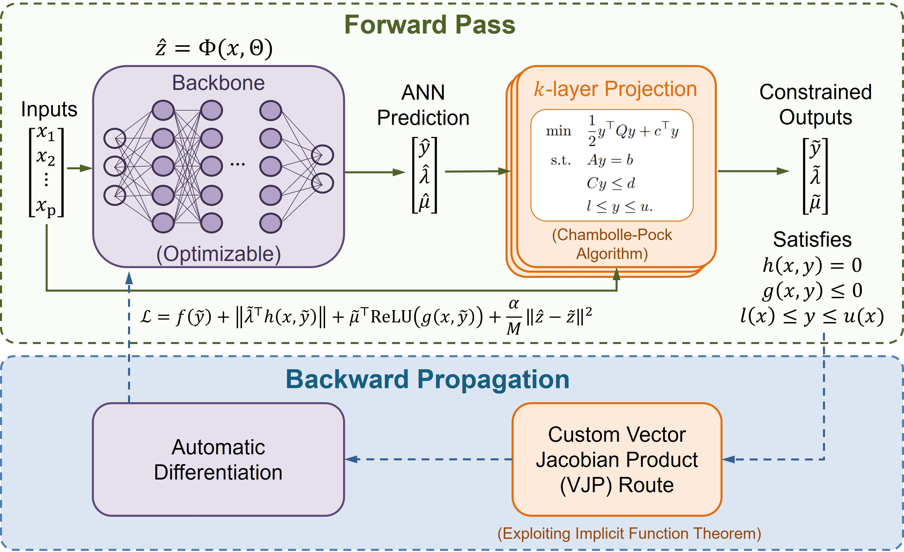
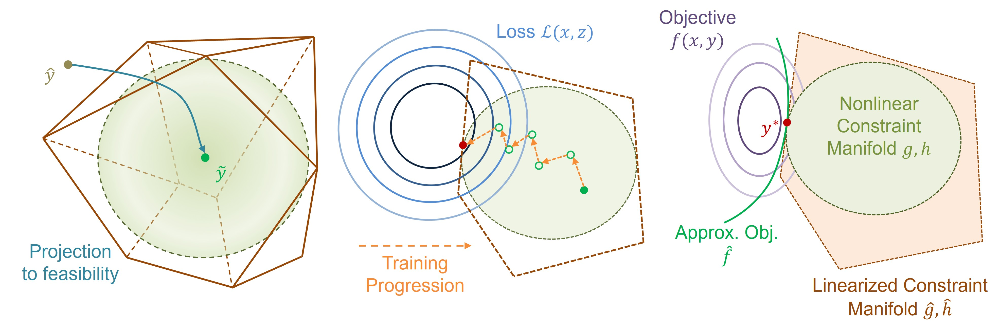

:orphan:

NLPOpt-Net
==========

**N**\ on\ **L**\ inear **P**\ arametric **Opt**\ imization **Net**\ work (NLPOpt-Net) is a GPU supported python package for learning parameters to solution mappings for nonlinear parametric optimization problem.

   Figure 1: Overview of the NLPOpt-Net framework.

Installation
------------

Currently, NLPOpt-Net requires Python 3.9 or later and supports installation for both CPU-only and GPU-accelerated environments.

- CPU-only (Linux/macOS/Windows)

.. code-block:: bash

   pip install nlpoptnet

- GPU (NVIDIA, CUDA 12)

.. code-block:: bash

   pip install "nlpoptnet[cuda12]"

Quick Overview
--------------

To give a quick understanding of what we are doing, we are trying to predict a solution (:math:`y`) of the parameterized optimization problem,

.. math::

   \begin{aligned}
   \quad
   \min \quad & f(x,y) \\
   \text{s.t.} \quad & h(x,y) = 0, \\
   & g(x,y) \le 0, \\
   & l(x) \le y \le u(x),
   \end{aligned}

for a given set of parameter (:math:`x`). The core idea is to train a machine learning model in an unsupervised way and predict new solutions. For feasibility guarantee a projection layer is employed. Particularly, we approximate the original problem into a specific structure of quadratic program and solve that to retain feasibility. Graphically, the projection as training progresses would look like this:

   Figure 2: Graphical interpretation of the projection.

For a detailed idea, we refer readers to `this article <https://paperlink.com>`_. Complete user documentation can be found `here <https://putyourdocumentationlink.com>`_.

Core API
~~~~~~~~

- ``NLPOptNet(config=..., type=...)`` is the user-facing entry point.
- ``model.extract(problem.npz)`` loads structured matrices and exposes them as
  model attributes like ``model.Q``, ``model.A``, ``model.b``, and so on.
- ``model.dataset(...)``, ``model.simplex(...)``, and ``model.box(...)`` define the
  parameter region.
- ``model.constraints.box.add(...)`` is separate from general inequalities so the
  bound constraints stay on the dedicated projection path.
- ``model.optimize()`` trains and returns a result dictionary with ``output_dir``,
  ``metadata_path``, ``summary``, and ``history``.
- ``model.load(metadata_path)`` restores a trained model, and
  ``model.predict(x_value)`` returns projected variable predictions.

General Workflow
----------------

The core ideas can be generalized in a workflow for training and inference tasks.

Model Creation and Training
~~~~~~~~~~~~~~~~~~~~~~~~~~~

Following is a general pseudocode for building and running a problem with NLPOpt-Net.

.. code-block:: python

   from nlpoptnet import NLPOptNet

   CONFIG = {...}

   model = NLPOptNet(config=CONFIG, name="problem_name")

   x = model.add_parameter([...])
   y = model.add_variable([...])

   model.extract("path/to/problem_data")
   model.objective(...)

   model.constraints.equality.add(...)
   model.constraints.inequality.add(...)
   model.constraints.box.add(...)

   model.dataset(parameters="path/to/parameters.csv")

   model.build()
   result = model.optimize()

   run_dir = result["output_dir"]

Load and Use a Trained Model
~~~~~~~~~~~~~~~~~~~~~~~~~~~~

After training, a saved model can be reloaded to inspect the run summary, visualize the training history, and make new predictions.

.. code-block:: python

   reloaded = NLPOptNet().load(metadata_path)

   reloaded.summary()
   reloaded.plot_history()

   sample_pred = reloaded.predict(sample_x, projection_backend="backend/type/for/prediction")

Example
-------

Following is an example of the summary and history plot for a trained model.

.. code-block:: python

   model.summary()

.. code-block:: text

   📊 NLPOptNet Summary
   ------------------------------------------------------------
   Model Name                        : example_model
   No. of Parameters                 : 50
   No. of Variables                  : 100
   No. of Equalities                 : 50
   No. of Inequalities               : 50
   No. of Train Samples              : 1000
   No. of Validation Samples         : 1000
   Maximum Constraint Violation      : 7.5433e-11
   Training Time                     : 1518.25 s
   Est. JAX Single Inference Time    : 91.49 ms
   Est. Native Single Inference Time : 1.99 ms
   Est. JAX Batch Inference Time     : 140.02 ms
   ------------------------------------------------------------

.. code-block:: python

   model.plot_history()

.. image:: figures/example_history.png
   :align: center
   :width: 100%

Reporting a Bug or Error
------------------------

We understand that running into issues can be frustrating. If you experience any errors while using NLPOpt-Net, please let us know so we can address them in future updates.

When reporting a bug, it is helpful to include:

- A brief description of the issue
- Relevant code snippets
- Error messages or logs
- Steps to reproduce the problem

Your feedback is greatly appreciated and helps us improve the package.

Citation
--------

If you use this package in your work, please cite us using the :doc:`citations` page.