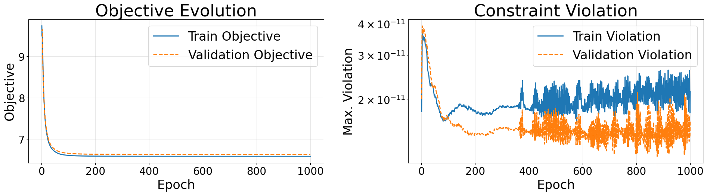

Training and Inference
======================

After defining the problem and configuration, the model can be built, trained, and used for inference as shown below.

Build and Train
---------------

- ``model.build()`` constructs the symbolic model, prepares the dataset, and initializes the training pipeline.
- ``model.optimize()`` trains the model and saves all artifacts, including model weights, history, summary, and metadata, to a timestamped directory.
- ``run_dir`` points to the directory where results are stored.

.. code-block:: python

   model.build()

   result = model.optimize()
   run_dir = Path(result['output_dir'])

   print('run_dir =', run_dir)

Model Summary and Training History Visualization
------------------------------------------------

``summary()`` function prints a summary after the model is trained. It includes the model name, the size of the model, number of samples considered during training, training time, maximum constraint violation and an estimation of inference times.

.. code-block:: python

   model.summary()

.. note::

   Inference time estimations are based on microbenchmarking on the training hardware and may vary across different hardware and runtime conditions.

The ``plot_history()`` function generates a plot showing the training behavior of the model. The plot includes:

- Objective evolution for training and validation samples.
- Constraint violation over epochs, typically shown on a logarithmic scale.

.. code-block:: python

   model.plot_history()

After training, NLPOpt-Net automatically saves all relevant files inside the output directory:

``<model_name>_<YYYYMMDD>_<HHMMSS>/``

The following files are generated:

- ``metadata.json`` — Stores the complete model configuration, problem definition, architecture details, and references to all saved files. This file is used to reload the trained model.
- ``summary.json`` — Contains aggregated training statistics such as final loss, objective values, constraint violations, dataset sizes, training time, and estimated inference times.
- ``history.csv`` — Stores per-epoch training history including training/validation loss, objective values, and constraint violations. This file is used for visualization via ``plot_history()``.
- ``parameters.csv`` — Contains sampled parameter inputs :math:`x` used for training and validation.
- ``predicted_variables.csv`` — Contains the corresponding predicted decision variables :math:`y` from the trained model.
- ``model_weights.npz`` — Stores the full trained model weights, including both backbone and projection-related parameters.
- ``backbone_weights.npz`` — Stores only the neural network (backbone) weights.
- ``problem.npz`` — Encodes the optimization problem structure (e.g., matrices, coefficients).
- ``problem_constants.npz`` — Stores constant components of the problem for efficient reuse during inference.
- ``projection_native.json`` — Contains metadata describing the compiled native projection backend, including platform-specific shared libraries stored inside the saved run folder.

Reloading the Model
-------------------

After training, the model can be reloaded from the saved ``metadata.json`` file.

.. code-block:: python

   from nlpoptnet import NLPOptNet
   reloaded = NLPOptNet().load('path/to/metadata.json')

The ``load(...)`` function restores the trained model, including the configuration, learned weights, problem definition, and available inference backends from the saved run directory. A parameter sample can then be provided to the trained model to compute the corresponding prediction. NLPOpt-Net supports two projection backends during inference.

.. code-block:: python

   sample_pred_native = reloaded.predict(sample_x, projection_backend='native')
   sample_pred_jax = reloaded.predict(sample_x, projection_backend='jax')

- ``jax`` — Uses the JAX-based implementation of the projection layer. This backend is fully portable and supports efficient batch inference.
- ``native`` — Uses a compiled native (C-based) implementation of the projection layer. This backend is optimized for fast single-sample inference and is recommended for deployment.

.. note::

   To use the ``native`` backend, a C compiler must be installed on the system. The saved run keeps native binaries under its own ``native_projection/`` folder, and if a model is reloaded on a different supported OS/architecture, NLPOpt-Net will compile a matching native binary for the current system into that same run directory.
